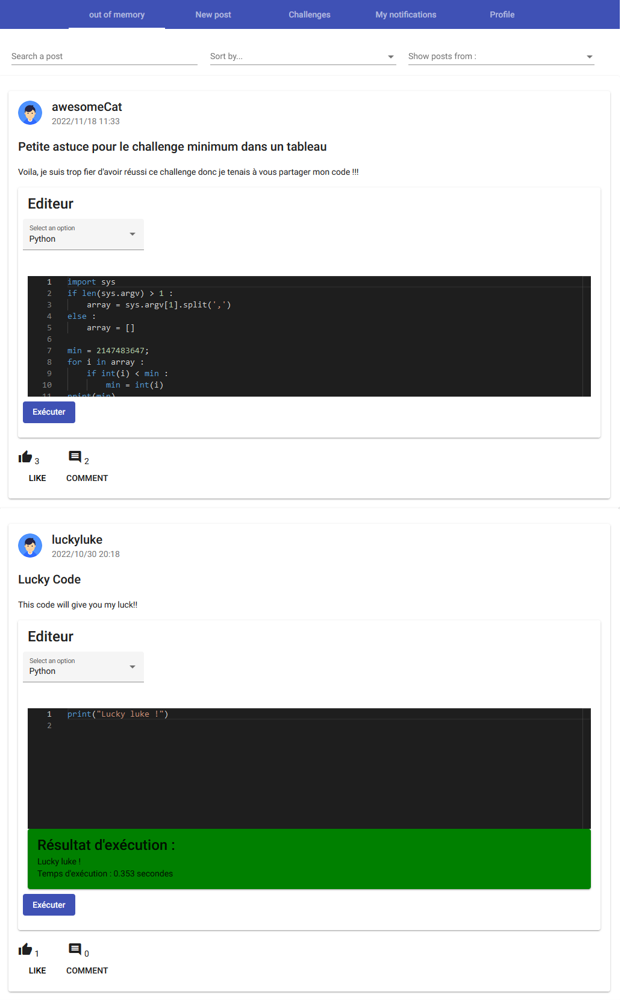
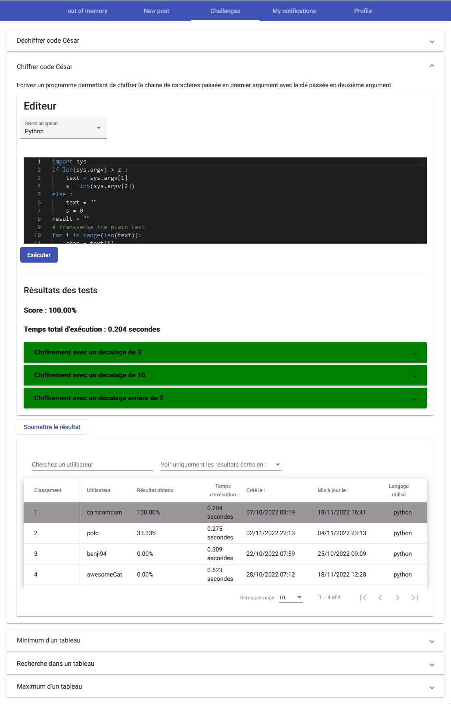
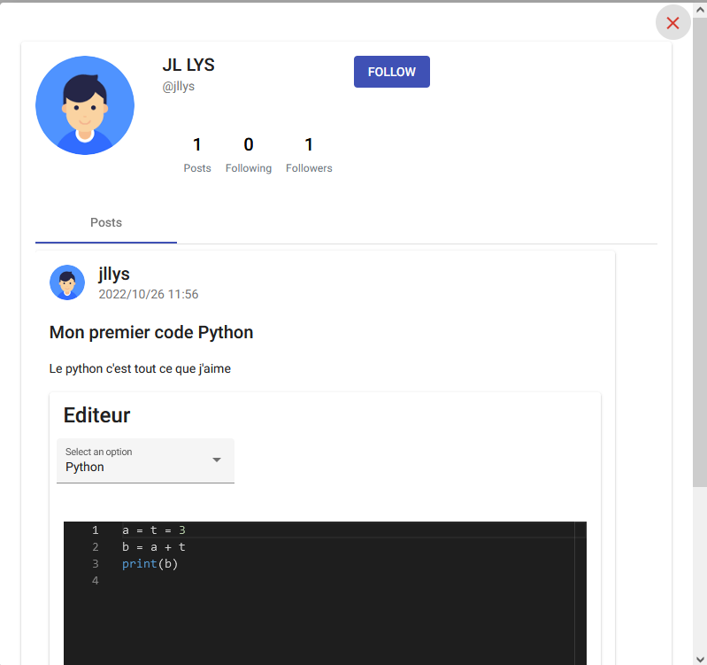

# OutOfMemoryFrontOffice

Ce projet est un projet de réseau social de partage de code. 
   
Il permet aux utilisateurs d'interagir entre eux comme sur un réseau social classique, mais aussi d'exécuter le code partagé pour obtenir le résultat d'exécution.
  
Il existe également un système de challenge dans lequel les utilisateurs vont concourrir les uns contre les autre, en résolvant des problèmes avec le langage de leur choix
  
Ce projet est déployé sur Microsoft Azure via Azure pipelines, et communique avec deux autres projets :

- L'API backoffice (https://github.com/amaurygrillot/reseau_social), déployé sur Microsoft Azure avec GitHub Actions 
- L'API d'exécution de code (https://github.com/amaurygrillot/OutOfMemoryError-external-code-executer), déployé sur Microsoft Azure avec Azure Pipelines via Dockerfile.

## Page d'accueil avec tous les nouveaux posts

## Les challenges

## Le profil

